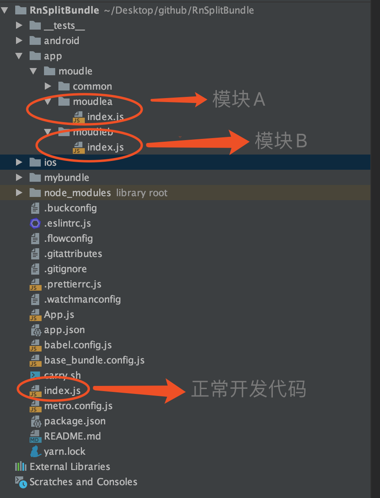
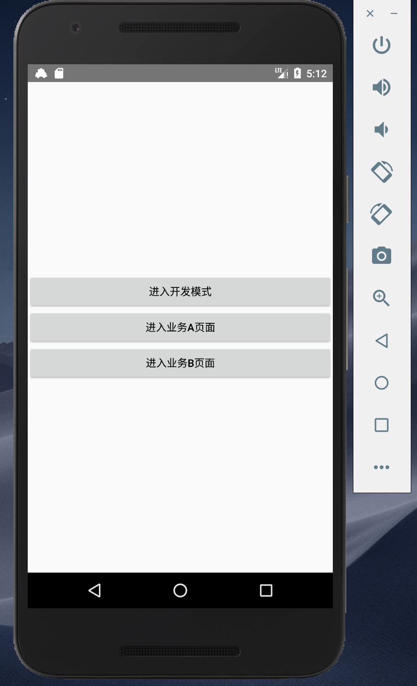
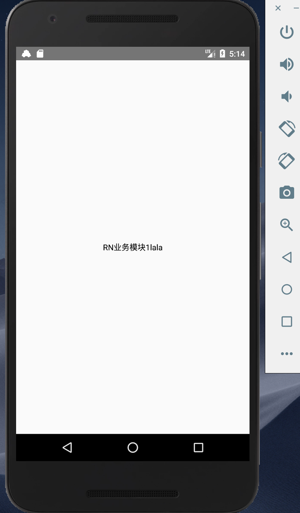
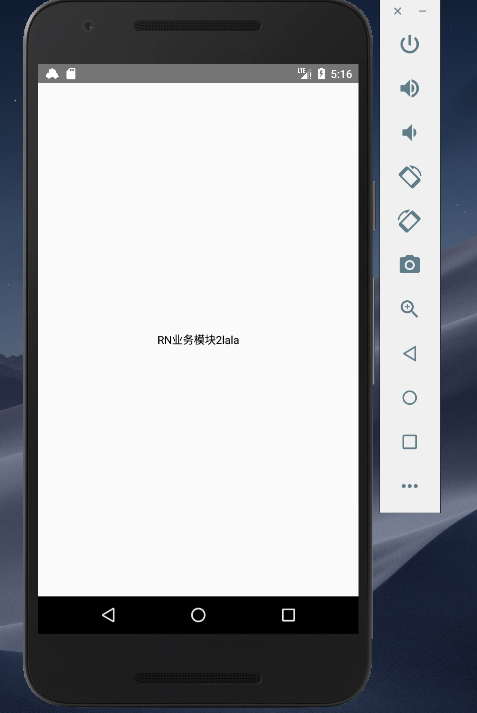

# RnSplitBundle
RN拆包，支持0.60以及更高版本，拆分成通用包和业务包。
看下代码结构

模块A,模块B属于二个不同业务，和通常项目的业务一样，具体请看代码。
模块A,模块B拥有一些通用的功能，我们把其通用部分放入到common目录下。

项目中index.js用于正常的代码开发，可把不同业务入口放入其中，用于开发状态下看不同业务的效果。

点击业务B,进入

开发模式就是yarn start正常开发代码就可以看到。

carry.sh里面包含生成通用bundle包以及业务包的方法，以及业务包与通用包对比，生成差异包，移动到android对应的目录，carry.sh是mac脚本根据自己的平台修改就行。
我加载业务bundle时，提供了两种模式一个是预加载业务bundle，另外一个是加新的活动时加载加载业务bundle，根据自己的需求用不的方式就行。
有问题，提issue,原理我会写到简书上,然后放入相应的链接，待续中....
